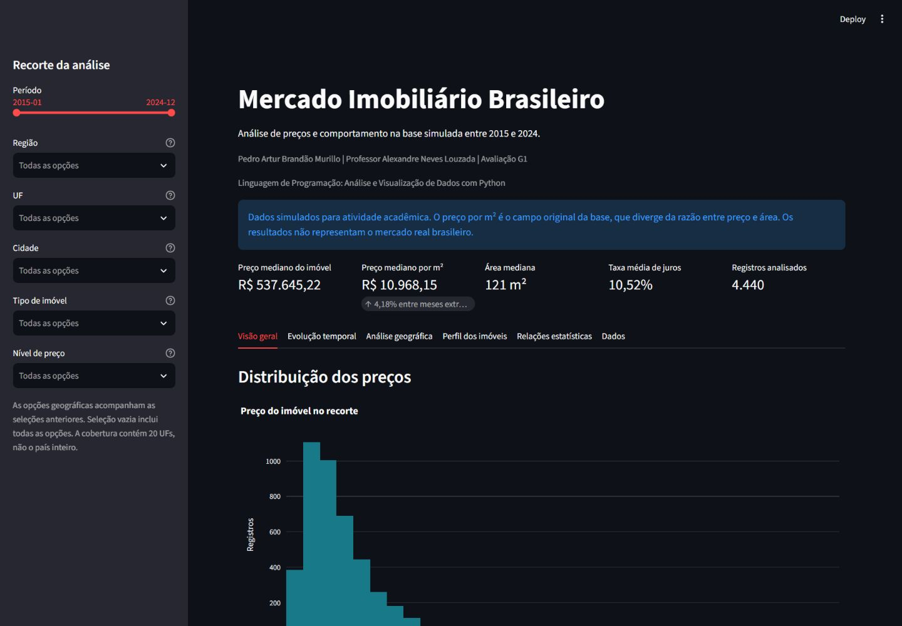

# Mercado Imobiliário Brasileiro

Análise de preços e comportamento do mercado na base simulada entre 2015 e 2024.

## Identificação acadêmica

- Aluno: Pedro Artur Brandão Murillo
- Professor: Alexandre Neves Louzada
- Disciplina: Linguagem de Programação: Análise e Visualização de Dados com Python
- Avaliação: G1
- Tema 12: Mercado Imobiliário Brasileiro

## Sobre o projeto e problema analisado

O projeto investiga como os preços se comportam na base simulada, considerando localização, características dos imóveis e indicadores econômicos. O notebook documenta os cálculos e o dashboard permite explorar recortes.

Pergunta central: **Como os preços dos imóveis se comportam na base simulada do mercado imobiliário brasileiro entre 2015 e 2024, considerando localização, características dos imóveis e indicadores econômicos?**

## Base de dados

O CSV foi obtido do [material do professor](https://github.com/AlexandreLouzada/Dados-Simulados-G2/blob/main/datasets_g2_30_temas/simulacao_mercado_imobiliario_brasil.csv) e preservado sem alterações.

A execução local confirmou 4.440 registros, 16 colunas originais e 120 meses, de janeiro de 2015 a dezembro de 2024. Há uma observação por cidade em cada mês: 37 cidades, 20 UFs e cinco regiões. A base não cobre todas as 27 UFs.

As variáveis incluem período, região, UF, cidade, bairro, tipo de imóvel, área, quartos, vagas, preço do imóvel, preço por m², renda média, taxa de juros e nível de preço. São dados simulados, sem representatividade estatística do mercado real.

## Perguntas da análise

- Como a mediana do preço por m² oscila por mês?
- Como as medianas diferem entre regiões, UFs e cidades presentes?
- Como os preços se distribuem por tipo de imóvel, área, quartos e vagas?
- Existem associações lineares entre preços, características e indicadores econômicos?
- O preço por m² fornecido corresponde à razão entre preço e área?

## Tecnologias utilizadas

| Tecnologia | Uso efetivo |
| --- | --- |
| Python e Pandas | Preparação, agregações, KPIs e média móvel |
| NumPy | Auditoria numérica e seleção dos pares de correlação |
| Matplotlib e Seaborn | Histogramas, boxplots e matriz de correlação |
| Plotly | Gráficos interativos de distribuição, série temporal, geografia e dispersão |
| Streamlit | Dashboard único com filtros dependentes |
| SQLAlchemy e SQLite | Persistência e leitura dos registros preparados |
| GitHub | Código, notebook e publicação da apresentação |

## Estrutura do projeto

```text
app.py
requirements.txt
README.md
index.html
.gitignore
dados/simulacao_mercado_imobiliario_brasil.csv
database/mercado_imobiliario.sqlite
notebooks/analise_mercado_imobiliario.ipynb
imagens/dashboard-preview.png
```

## Tratamento e preparação

As datas foram convertidas para `datetime` e foi criado `ano_mes` para agrupamento e filtros. Os testes não encontraram valores ausentes, duplicatas, datas inválidas, preços ou áreas não positivos, contagens negativas ou divergências entre data, ano e mês. As relações cidade/UF e UF/região foram conferidas. Nenhuma linha precisou ser removida.

O método IQR classificou 248 preços como extremos, equivalentes a 5,59% dos registros. Eles foram mantidos: não há evidência suficiente de erro e preços elevados são plausíveis.

`preco_m2_calculado = preco_imovel / area_m2` existe somente na auditoria do notebook. Sua correlação com o campo fornecido é -0,0175, e a diferença relativa absoluta mediana é 63,64%. O dashboard e o banco preservam `preco_m2` original. `nivel_preco` é tratado como categoria, sem presumir uma escala monetária coerente.

## KPIs e principais resultados

| Indicador da base completa | Resultado |
| --- | ---: |
| Preço mediano do imóvel | R$ 537.645,22 |
| Preço mediano por m² fornecido | R$ 10.968,15 |
| Área mediana | 121 m² |
| Taxa média de juros | 10,52% |
| Registros | 4.440 |

A mediana mensal por m² passou de R$ 11.564,40 em janeiro de 2015 para R$ 12.048,09 em dezembro de 2024, diferença de 4,18%. A série oscila; a diferença entre os extremos não demonstra valorização contínua. A média móvel considera 12 meses completos.

Centro-Oeste apresenta a maior mediana regional por m², e Petrópolis a maior mediana entre as cidades presentes. Esses resultados são comparações dentro da simulação.

A maior correlação linear absoluta entre as sete variáveis analisadas é de aproximadamente 0,034, entre vagas de garagem e renda média (r = -0,0337). As associações são fracas e não demonstram causalidade.

## Funcionalidades intermediárias

O dashboard permite filtrar período, região, UF, cidade, tipo de imóvel e nível de preço. As opções geográficas dependem das seleções anteriores. KPIs, gráficos, tabelas e interpretações acompanham o recorte, que pode ser baixado em CSV.

## Funcionalidades avançadas

Os dados preparados estão na tabela `mercado_imobiliario` do SQLite versionado. O app lê o banco com SQLAlchemy e utiliza cache; se o banco não existir, reconstrói a tabela a partir do CSV. O notebook demonstra uma consulta SQL.

Também foram implementadas média móvel de 12 meses, correlação estatística, gráficos interativos e conclusão dinâmica. Recortes com um mês, um registro ou correlações indefinidas são tratados.

## Análises realizadas

O [notebook executado](notebooks/analise_mercado_imobiliario.ipynb) contém inspeção, qualidade, estatísticas descritivas, IQR, auditoria do preço por m², persistência, distribuição de preços e área, análise temporal, comparação geográfica, perfil por tipo, quartos e vagas, correlação e conclusão.



## Como executar localmente

Recomendado: Python 3.12 ou superior.

```bash
git clone https://github.com/pedro-art2611/projeto-g1-mercado-imobiliario.git
cd projeto-g1-mercado-imobiliario
python -m venv .venv
```

No Windows (PowerShell):

```powershell
.venv\Scripts\Activate.ps1
```

No Linux ou macOS:

```bash
source .venv/bin/activate
```

Depois:

```bash
python -m pip install -r requirements.txt
python -m streamlit run app.py
```

Para reexecutar o notebook, instale as ferramentas opcionais:

```bash
python -m pip install jupyter nbconvert ipykernel
jupyter nbconvert --to notebook --execute --inplace notebooks/analise_mercado_imobiliario.ipynb
```

Execute a partir da raiz do projeto. O notebook recria a tabela SQLite; o CSV permanece intacto. As ferramentas Jupyter não são necessárias para o dashboard.

## Publicação

- [Repositório GitHub](https://github.com/pedro-art2611/projeto-g1-mercado-imobiliario)
- [Apresentação no GitHub Pages](https://pedro-art2611.github.io/projeto-g1-mercado-imobiliario/)
- [Dashboard Streamlit](https://projeto-g1-mercado-imobiliario-9njgs7po5ls3yj7mvsc9kx.streamlit.app/)

No Streamlit Community Cloud, selecione o repositório, branch `main` e arquivo `app.py`. Recomenda-se Python 3.12. No GitHub Pages, utilize a branch `main` e a pasta raiz `/` como origem.

## Limitações e conclusão

A simulação não acompanha imóveis individuais, não cobre todas as UFs e não ajusta os preços pela inflação. Os indicadores de preço por m² não são matematicamente equivalentes à razão entre preço e área. Os níveis de preço não devem ser usados como uma escala quantitativa.

A base apresenta dispersão de preços e oscilações mensais. A mediana permite resumir o conjunto sem eliminar os valores extremos. As correlações lineares são fracas. As conclusões se limitam aos registros analisados e não descrevem todo o mercado imobiliário brasileiro.
